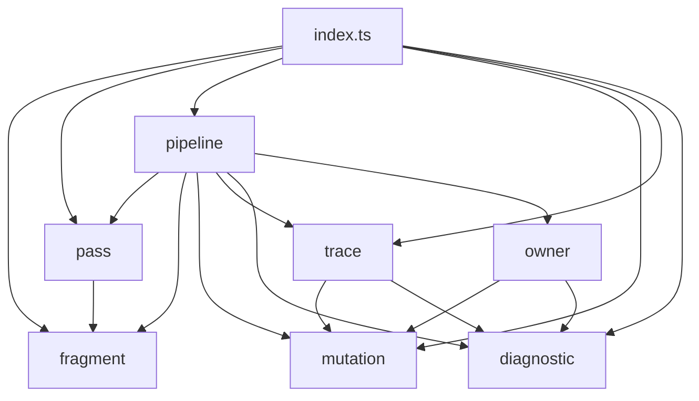
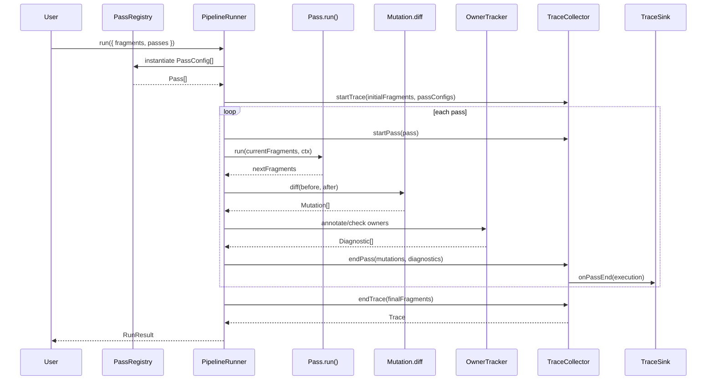
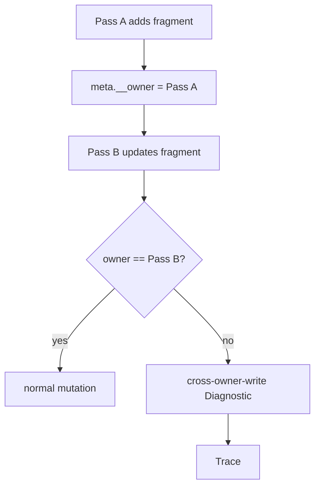

# Loom Core v0.1 Engineering Blueprint

> **Status**: Implemented Alpha checkpoint（Core 语义收敛版 + Stdlib MVP，2026-05-01）
> **Purpose**: 将已接受的架构决策（ADR-001 ~ ADR-007）翻译成 `@loom/core` 正式版的工程施工图。
> **Audience**: Core 实现者、Stdlib / DevTool 作者、Studio Kernel 集成者。
> **Non-Replacement**: 本文不替代白皮书、Observability 文档或 ADR；它只约束 v0.1 工程实现。

---

## 0. 这份文档解决什么问题

Loom 的架构文档已经回答了：

- Loom 是什么；
- Core 应该做什么、不做什么；
- Studio 与 Core 的边界；
- Trace / DevTool / Extension 的长期方向；
- PoC 后 7 个关键问题的 ADR 裁决。

但正式开发 `@loom/core` 前，还需要一份更低层的工程蓝图，回答：

1. 正式版 `packages/core` 的理想文件目录是什么；
2. 每个内部模块负责什么；
3. 一次 `loom.run()` 的数据流怎么走；
4. PassFactory / PassRegistry / Trace / Mutation / Owner Tracking 如何协作；
5. 哪些 PoC 时代的实现不再进入正式版；
6. v0.1 的测试矩阵和实现顺序是什么。

本文的目标不是继续扩张设计面，而是**收窄实现面**。

---

## 0.1 当前实现进度（2026-05-01）

正式版已从根目录启动，不再继续扩展 `poc/`。当前落地范围：

```text
packages/core/      @loom/core Alpha 语义收敛版
packages/stdlib/    @loom/stdlib MVP + validatePipeline skeleton
```

### 已完成

- 根目录正式版 pnpm workspace 已建立；
- `@loom/core` 已实现同步 Pipeline / Pass / PassFactory / PassRegistry；
- `Fragment.content` 已收紧为 `string`；
- Core 不再支持 Promise content / thunk / ResolutionPass；
- Core 不做 `requires/provides` capability validation；
- 默认 Trace 为 mutation-only，snapshot 默认关闭；
- Mutation payload 已自包含，`replayTrace()` 仅依赖 `initialFragments + mutations`；
- Trace 顶层已有 `status` / `error`；
- Trace JSON Schema 已存在并由 AJV 测试覆盖；
- owner tracking 已实现并收紧为可信默认：
  - 初始 input fragment 强制 owner 为 `input`；
  - 新增 fragment 强制 owner 为当前 `pass.name`；
  - pass 试图修改已有 fragment 的 `meta.__owner` 会失败；
  - 修改 / 删除其他 owner 的 fragment 会产生 `loom/cross-owner-write`；
- Pipeline 错误边界已收敛为 `RunResult.status = 'error'`，避免混用 throw 与返回值；
- pass throw 前的 diagnostics 会保留；
- pass 原地修改后 throw 不会污染返回结果；
- Promise-returning pass 会同步失败，并吞掉 rejected Promise 以避免 unhandled rejection；
- `@loom/stdlib` 已提供基础 pass factories、params guard、`createStdlibRegistry()` 与 `validatePipeline()` MVP；
- Core / Stdlib 均可 typecheck / test / build。

当前验证状态：

```text
@loom/core     6 test files / 47 tests passed
@loom/stdlib   1 test file  / 11 tests passed
```

已通过命令：

```bash
pnpm --filter @loom/core typecheck
pnpm --filter @loom/core test
pnpm --filter @loom/core build

pnpm --filter @loom/stdlib typecheck
pnpm --filter @loom/stdlib test
pnpm --filter @loom/stdlib build
```

### 尚未完成 / 不在当前 Alpha 范围

- `@loom/st` 真实 pipeline 迁移验证尚未开始；
- `@loom/devtool` 尚未正式创建；
- Studio Kernel 尚未开始实现；
- Trace runtime 的完整 JSON Schema validation 未打进 Core 包，当前只提供轻量 `deserializeTraceChecked()`；
- `ctx.diagnose({ severity: 'error' })` 仍是 advisory diagnostic，不自动让 pipeline 失败；
- failed pass 目前进入 Trace 顶层 `status/error`，但还没有独立 failed `TraceExecution`；
- meta 的 JSON-serializable runtime guard 尚未完整实现。

---

## 1. v0.1 工程原则

### 1.1 Core 是同步、确定、可重放的纯执行层

v0.1 的核心运行模型是：

```ts
Fragment[] + PassConfig[] -> Fragment[] + Trace
```

这意味着：

- Pass 链按声明顺序同步执行；
- `Pass.run()` 不返回 Promise；
- `Pipeline.run()` 不返回 Promise；
- Core 内不做 IO；
- 异步数据准备发生在 Core 之外，通过 `PassConfig.params` 或初始 `fragments` 注入；
- Trace 可用 `initialFragments + mutations` 重放。

### 1.2 Core 不读领域语义

Core 只理解机械结构：

- fragment id 是否为空 / 重复；
- Pass 是否返回合法 fragments；
- mutation 如何计算；
- trace 如何记录；
- owner 是否被篡改。

Core 不理解：

- role / message / chat / character；
- worldbook / lorebook；
- priority / token / provider；
- template / macro / scope；
- capability 语义链路。

`requires/provides` 字段可以存在于 Pass / PassFactory 上，但 Core 不校验它们。校验属于 `@loom/stdlib` 的 `validatePipeline`。

### 1.3 Core 默认可观测，但默认不存全量 snapshot

依据 ADR-002：

- mutation-only trace 默认开启；
- snapshot 默认关闭；
- snapshot 是显式 opt-in；
- `FileSink` 不进入 `@loom/core`，属于 `@loom/devtool`。

### 1.4 Core 对 meta 只有一个例外：`meta.__owner`

依据 ADR-004：

- Core 保留 `meta.__owner`；
- Core 在 fragment 被创建时写入 owner；
- 后续 Pass 修改非自己 owner 的 fragment 不阻拦，但产生 Diagnostic；
- 修改 `meta.__owner` 本身直接抛错。

这是 Core 唯一主动写入 / 读取的 meta 字段，必须被隔离在 `owner/` 模块内。

---

## 2. Public API 草案

本节是 v0.1 实现的 API 目标。后续代码若需要偏离，应先更新本文或新增 ADR。

### 2.1 Fragment

```ts
export interface Fragment<M = unknown> {
  readonly id: string
  readonly content: string
  readonly meta: M
}
```

v0.1 约束：

- `content` 只接受 `string`；
- 不接受 `Promise<string>`；
- 不接受 thunk；
- fragment 应当 JSON-serializable；
- `id` 由 fragment 创建者负责，Core 只校验非空与唯一。

### 2.2 Pass

```ts
export interface Pass<M = unknown> {
  readonly name: string
  readonly version?: string

  /** 声明字段：Core 不读；Stdlib / DevTool 可读。 */
  readonly reads?: readonly string[]
  readonly writes?: readonly string[]
  readonly requires?: readonly string[]
  readonly provides?: readonly string[]

  run(
    fragments: readonly Fragment<M>[],
    ctx: PassContext
  ): readonly Fragment<M>[]
}
```

v0.1 约束：

- `run()` 必须同步；
- 返回 Promise 是运行时错误，TypeScript 层也应尽量拒绝；
- Pass 应视为纯函数：相同输入应得到相同输出；
- Pass 不应持有跨 invocation 可变状态；
- Pass 不应做文件 / 数据库 / 网络 IO。

### 2.3 PassContext

```ts
export interface PassContext {
  readonly passName: string
  readonly passIndex: number

  diagnose(diagnostic: DiagnosticInput): void
  log(message: string, data?: unknown): void
}
```

v0.1 暂不提供：

- `scope`；
- `history` / snapshots；
- `AbortSignal`；
- 异步资源句柄。

如果未来重新引入取消、scope、sub-pipeline，应另起设计，不在 v0.1 暗留半成品接口。

### 2.4 PassFactory

```ts
export interface PassFactory<P = unknown, M = unknown> {
  readonly name: string
  readonly version?: string

  /** 给 Stdlib lint / Studio Workbench / DevTool 表单使用，Core 只透传。 */
  readonly paramsSchema?: unknown

  readonly reads?: readonly string[]
  readonly writes?: readonly string[]
  readonly requires?: readonly string[]
  readonly provides?: readonly string[]

  create(params: P): Pass<M>
}
```

约束：

- `create(params)` 必须同步；
- 相同 params 应创建行为等价的 Pass；
- params 必须 JSON-serializable；
- factory 抛错时，Core 记录 `loom/factory-threw` Diagnostic 并终止 run。

### 2.5 PassConfig

```ts
export interface PassConfig<P = unknown> {
  readonly name: string
  readonly params?: P
}
```

`PassConfig` 是 JSON 化 Pipeline 的基本单元。它服务于：

- Studio Transport；
- Trace replay；
- DevTool Workbench；
- CI fixture；
- 第三方客户端。

### 2.6 RunConfig / RunResult

```ts
export interface RunConfig<M = unknown> {
  readonly fragments: readonly Fragment<M>[]
  readonly passes: readonly PassConfig[]
  readonly registry: PassRegistry<M>
  readonly trace?: TraceOptions
}

export interface RunResult<M = unknown> {
  readonly fragments: readonly Fragment<M>[]
  readonly trace: Trace<M>
  readonly diagnostics: readonly Diagnostic[]
  readonly status: 'ok' | 'error'
  readonly error?: SerializedError
}
```

`trace` 在 v0.1 默认存在，但可以通过 `trace.mode = 'off'` 关闭到近似 no-op。

当前实现说明：

- `pipeline([pass]).run(fragments, traceOptions?)` 仍作为便捷入口存在，方便单元测试与直接代码调用；
- `run({ fragments, passes, registry, trace })` 是面向 Studio / Transport / Workbench 的配置化主入口；
- `trace.mode = 'off'` 时，`RunResult.fragments` 仍返回真实结果，但 Trace payload 近似 no-op（`executions/finalFragments` 为空）。

---

## 3. Ideal Package Layout

正式版 `packages/core` 的目标目录如下：

```text
packages/core/
├── package.json
├── tsconfig.json
├── tsconfig.build.json
├── src/
│   ├── index.ts
│   │
│   ├── fragment/
│   │   ├── types.ts
│   │   ├── validate.ts
│   │   └── clone.ts
│   │
│   ├── pass/
│   │   ├── types.ts
│   │   ├── registry.ts
│   │   └── validate.ts        # planned / optional helper
│   │
│   ├── pipeline/
│   │   ├── pipeline.ts
│   │   ├── runner.ts
│   │   ├── context.ts
│   │   └── errors.ts
│   │
│   ├── mutation/
│   │   ├── types.ts
│   │   ├── diff.ts
│   │   └── replay.ts          # applyMutation + replayTrace
│   │
│   ├── trace/
│   │   ├── types.ts
│   │   ├── collector.ts
│   │   ├── null-sink.ts       # planned
│   │   ├── memory-sink.ts     # planned
│   │   ├── console-sink.ts    # planned
│   │   ├── serialize.ts
│   │   └── format.ts          # planned
│   │
│   ├── diagnostic/
│   │   ├── types.ts
│   │   ├── codes.ts           # planned
│   │   └── create.ts          # planned
│   │
│   ├── owner/
│   │   └── owner.ts
│   │
│   └── utils/
│       ├── assert.ts
│       ├── deep-equal.ts
│       ├── stable-json.ts     # planned
│       └── ids.ts             # planned
│
│   └── schemas/
│       └── trace.schema.json
│
└── test/
    ├── fragment.test.ts
    ├── pass-registry.test.ts
    ├── pipeline.test.ts
    ├── mutation-replay.test.ts
    ├── trace.test.ts
    ├── trace-schema.test.ts
    ├── owner.test.ts
    └── errors.test.ts
```

当前实现允许少量文件名与上图不同，但职责边界必须保持一致。尚未实现的 planned 文件不阻塞 Alpha；它们属于后续整理 / DevTool 友好性增强。

---

## 4. Module Responsibility Map

### 4.1 `fragment/`

负责 Fragment 的结构层：

- `Fragment` 类型；
- id 非空校验；
- id 唯一校验；
- content 类型校验；
- JSON-serializable 辅助校验；
- shallow clone helper。

不负责：

- role / priority / subject 等 meta 语义；
- owner tracking；
- token 统计。

### 4.2 `pass/`

负责 Pass 与 PassFactory：

- `Pass` 类型；
- `PassFactory` 类型；
- `PassConfig` 类型；
- `PassRegistry`；
- factory 注册 / 查找 / 实例化；
- Pass 基本形态校验。

不负责：

- 执行顺序校验；
- capability lint；
- 运行 trace；
- Studio Extension 注册。

### 4.3 `pipeline/`

负责同步执行主循环：

- 接收 `RunConfig`；
- 调用 PassRegistry 实例化 Pass；
- 构造 PassContext；
- 顺序执行 Pass；
- 捕获 Pass 错误；
- 调用 mutation diff；
- 调用 owner tracker；
- 写入 trace collector；
- 返回 RunResult。

不负责：

- 读取文件 / 数据库；
- 自动重排 Pass；
- 自动修复 pipeline；
- capability 检查。

### 4.4 `mutation/`

负责 before / after 的结构变化：

- `Mutation` 类型；
- `diffFragments(before, after)`；
- `applyMutation(fragments, mutation)`；
- `replayTrace(trace, options?)`。

这是 DevTool 的基础解释器，必须独立于 pipeline 使用。

### 4.5 `trace/`

负责 trace 的收集与导出：

- `Trace` 类型；
- `TraceExecution` 类型；
- `TraceCollector`；
- `TraceSink`；
- `serializeTrace` / `deserializeTrace` / `deserializeTraceChecked`；
- planned：`NullSink` / `MemorySink` / `ConsoleSink`；
- planned：`formatTrace` 极简文本输出。

不负责：

- FileSink；
- HTML report；
- ANSI pretty printer；
- WebSocket / OTel / HTTP sink。

这些属于 `@loom/devtool` 或更上层。

### 4.6 `diagnostic/`

负责 Diagnostic 的统一结构与内建 code：

- `Diagnostic` 类型；
- `DiagnosticSeverity`；
- Core 内建 code；
- 创建 helper。

v0.1 Core 内建 code 至少包括：

| Code | 含义 |
|---|---|
| `loom/empty-id` | fragment id 为空 |
| `loom/duplicate-id` | 同一状态下 fragment id 重复 |
| `loom/invalid-fragment` | Pass 返回非法 fragment |
| `loom/invalid-pass` | factory 创建了非法 Pass |
| `loom/factory-missing` | 找不到 PassConfig 对应的 PassFactory |
| `loom/factory-threw` | PassFactory.create 抛错 |
| `loom/pass-threw` | Pass.run 抛错 |
| `loom/async-pass-result` | Pass.run 返回 Promise |
| `loom/cross-owner-write` | Pass 修改了其他 owner 的 fragment |
| `loom/owner-mutation` | Pass 试图修改 `meta.__owner` |

说明：早期草案使用过 `loom/pass-returned-promise` 命名；当前实现统一为 `loom/async-pass-result`。如后续要冻结 Diagnostic code，应以实际实现和 Trace schema 文档为准。

### 4.7 `owner/`

负责 ADR-004 的软所有权模型：

- 新增 fragment 自动写 `meta.__owner`；
- 初始 input fragment 归一化为 `meta.__owner = 'input'`；
- 检测 `meta.__owner` 是否被修改；
- 检测 cross-owner-write；
- 生成对应 Diagnostic。

该模块是 Core 唯一触碰 meta 语义的位置。除 `meta.__owner` 外，它不得读取任何业务字段。

---

## 5. Core Module Dependency Diagram



约束：

- `mutation/` 不依赖 `pipeline/`，保证 DevTool 可独立 replay；
- `trace/` 可以依赖 `mutation/` 与 `diagnostic/`，但不依赖 Studio；
- `owner/` 是横切模块，但只能被 `pipeline/` 调用；
- `fragment/` 是底层纯结构模块，不依赖其他业务模块。

---

## 6. Runtime Data Flow

一次 `run()` 的正式数据流如下：



关键点：

1. Registry 先把 `PassConfig[]` 实例化为 `Pass[]`；
2. Runner 按顺序执行；
3. 每个 Pass 前后都计算 mutation；
4. owner tracking 与 mutation diff 使用同一组 before/after fragment 事实源；当前实现直接比较 fragment，而不是消费 mutation records；
5. Trace 默认记录 mutation，不记录 full snapshot；
6. 最终结果包含 `fragments` 与 `trace`。

---

## 7. PassFactory / PassRegistry Model

```mermaid
flowchart LR
  Config[PassConfig JSON] --> Registry[PassRegistry]
  Registry --> Factory[PassFactory]
  Factory --> Pass[Pass instance]
  Pass --> Runner[Pipeline Runner]

  Factory --> Schema[paramsSchema]
  Schema --> StdlibLint[@loom/stdlib validatePipeline]
  Schema --> DevTool[Workbench Form]
```

### 7.1 Registry 规则

- `PassRegistry.register(factory)` 注册一个工厂；
- `factory.name` 是全局唯一键；
- 重名注册直接抛错，不允许覆盖；
- `PassRegistry.create(config)` 根据 `config.name` 查找 factory 并调用 `create(params)`；
- 找不到 factory 是运行前错误，并产生 `loom/factory-missing` Diagnostic；
- factory 抛错是运行前错误，并产生 `loom/factory-threw` Diagnostic；
- factory 相关 Diagnostic 通过 `meta.factoryName` / `meta.passIndex` 携带定位信息；
- Core 只透传 `paramsSchema`，不在 runtime 内做 schema validation；Stdlib / Studio / DevTool 可以消费该字段。

### 7.2 为什么 Core 需要 Registry

Registry 不是 Studio 专属能力，而是 Core 的配置化 Pipeline 基础：

- 没有 Registry，`PassConfig[]` 无法变成 `Pass[]`；
- 没有 `PassConfig[]`，Trace replay / Workbench / Transport 调度都只能传代码对象；
- 传代码对象无法跨进程、跨语言、跨 trace 重放。

因此 Registry 进入 `@loom/core`，但 Extension 注册、权限、manifest 仍属于 Studio。

---

## 8. Pipeline Execution Model

v0.1 Pipeline 是线性同步执行器。

```text
initial fragments
  -> Pass 0
  -> Pass 1
  -> Pass 2
  -> ...
  -> final fragments
```

### 8.1 执行步骤

每个 Pass 的执行步骤：

1. 保存 `before` 引用；
2. 调用 `pass.run(before, ctx)`；
3. 校验返回值是 fragment array；
4. 校验没有 Promise；
5. 校验 id 非空 / 唯一；
6. 计算 mutation；
7. 做 owner annotate / cross-owner 检测；
8. 写入 TraceExecution；
9. 进入下一 Pass。

### 8.2 错误语义

- factory 抛错：run 失败，trace 记录失败位置；
- Pass 抛错：run 失败，trace 记录 `loom/pass-threw`；
- Pass 返回 Promise：run 失败，trace 记录 `loom/async-pass-result`；
- Pass 返回非法 fragments：run 失败，trace 记录 `loom/invalid-fragment`；
- 初始 fragments 非法：run 返回 `status: 'error'`，而不是直接 throw；
- Pass 失败前通过 `ctx.diagnose()` 产生的 Diagnostic 会保留；
- Pass 若在 throw 前原地修改输入 fragments，失败结果会回滚到该 Pass 执行前的安全状态；
- Diagnostic 默认不中断，除非对应错误已经是结构性错误。

---

## 9. Mutation & Replay Model

### 9.1 Mutation 类型

```ts
export type Mutation<M = unknown> =
  | { readonly op: 'add'; readonly fragmentId: string; readonly index: number; readonly fragment: Fragment<M> }
  | { readonly op: 'remove'; readonly fragmentId: string; readonly index: number; readonly fragment: Fragment<M> }
  | { readonly op: 'update'; readonly fragmentId: string; readonly index: number; readonly before: Fragment<M>; readonly after: Fragment<M> }
  | { readonly op: 'move'; readonly fragmentId: string; readonly fromIndex: number; readonly toIndex: number }
```

v0.1 选择完整 `before / after` fragment，而不是 field-level patch。理由：

- DevTool 初期实现简单；
- replay 语义明确；
- fragment 通常较小；
- 若未来体积成为瓶颈，可在 v0.2 增加压缩或 field diff。

约束：

- `add/remove/update` mutation 必须自包含 replay 所需的 fragment payload；
- `move` 只表达顺序变化；
- 同一个 fragment 在同一个 pass 内可以同时产生 `move + update`；
- meta-only update 也必须产生 `update` mutation；
- 默认 TraceExecution 不允许通过 `afterFragments` 作为 replay shortcut。

### 9.2 Replay

```mermaid
flowchart TD
  Initial[initialFragments] --> Replay[replayTrace]
  Trace[Trace.executions] --> Replay

  Replay --> P0[State after Pass 0]
  Replay --> P1[State after Pass 1]
  Replay --> PN[State after Pass N]

  Mutation[Mutation[]] --> Replay
  DevTool[DevTool Timeline] --> Replay
```

Core 提供：

```ts
applyMutation(fragments, mutation): Fragment[]
replayTrace(trace, options?: { untilPassIndex?: number }): Fragment[]
```

DevTool 不应自行解释 mutation 语义，而应复用 Core 的 replay 函数。

---

## 10. Trace Model

### 10.1 Trace 顶层结构

```ts
export interface Trace<M = unknown> {
  readonly version: '1'
  readonly mode: 'on' | 'off'
  readonly status: 'ok' | 'error'
  readonly error?: SerializedError

  readonly initialFragments: readonly Fragment<M>[]
  readonly finalFragments: readonly Fragment<M>[]
  readonly passConfigs?: readonly PassConfig[]
  readonly executions: readonly TraceExecution<M>[]
  readonly diagnostics: readonly Diagnostic[]
}
```

当前 Alpha 实现暂不包含 `traceId` / `pipelineId` / `startedAt` / `durationMs` 等运行身份字段。它们保留为 DevTool / Studio Kernel 后续增强项，不阻塞 v0.1 Core 执行语义。

### 10.2 TraceExecution

```ts
export interface TraceExecution<M = unknown> {
  readonly passName: string
  readonly passIndex: number
  readonly durationMs: number
  readonly diagnostics: readonly Diagnostic[]
  readonly mutations: readonly Mutation<M>[]

  readonly snapshot?: {
    readonly before?: readonly Fragment<M>[]
    readonly after?: readonly Fragment<M>[]
  }
}
```

说明：失败状态目前记录在 Trace 顶层 `status/error`。失败 pass 作为独立 `TraceExecution(status/error)` 记录属于后续增强项；当前实现保证已完成 pass 的 execution 保留，失败 pass 之前的状态可通过 `trace.error` 与 diagnostics 定位。

### 10.3 Sink

Core 当前内置：

| Sink | 归属 | 用途 |
|---|---|---|
| `TraceCollector` | `@loom/core` | 默认内存收集 |
| `TraceSink` interface | `@loom/core` | 外部 sink 接口 |

Planned Core sinks（后续增强，不属于当前 Alpha 必需项）：

| Sink | 用途 |
|---|---|
| `NullSink` | trace off / no-op 显式对象 |
| `MemorySink` | 测试、REPL、默认收集的独立实现 |
| `ConsoleSink` | 极简无颜色文本输出 |

不进入 Core：

| Sink / Tool | 归属 |
|---|---|
| `FileSink` | `@loom/devtool` |
| ANSI pretty printer | `@loom/devtool` |
| HTML report | `@loom/devtool` |
| WebSocketSink | Layer 2+ |
| OTel / HTTP sink | Layer 2+ |

---

## 11. Diagnostic Model

Diagnostic 是结构化信息，不等于异常。

```ts
export interface Diagnostic {
  readonly severity: 'error' | 'warning' | 'info' | 'hint'
  readonly code: string
  readonly message: string

  readonly passName?: string
  readonly passIndex?: number
  readonly fragmentId?: string
  readonly relatedFragmentIds?: readonly string[]
  readonly at?: number
  readonly meta?: Record<string, unknown>
}
```

规则：

- Pass 可以通过 `ctx.diagnose()` 产出 Diagnostic；
- Core 结构性错误也产出 Diagnostic；
- Diagnostic 默认不会中断 run；
- 抛错 / 非法返回 / owner mutation 这类结构性错误会中断 run。

命名约定：

- Core 内建 code：`loom/<kebab-case>`；
- Stdlib code：`loom-stdlib/<kebab-case>`；
- 用户 code：`<namespace>/<kebab-case>`。

---

## 12. Owner Tracking Model



### 12.1 规则

1. 初始 input fragment 一律归一化为 `meta.__owner = 'input'`，不信任输入自带 owner；
2. 新增 fragment 一律写入 `meta.__owner = current pass.name`，不信任 pass 自带 owner；
3. 已存在 fragment 的 owner 来自 Core 之前写入的值；
4. 任何 update 若试图修改已有 fragment 的 `meta.__owner`，run 失败并产生 `loom/owner-mutation`；
5. 当前 Pass 修改或删除 `meta.__owner !== pass.name` 的 fragment，允许修改，但生成 `loom/cross-owner-write` Diagnostic；
6. 纯 move 不算 cross-owner write；
7. DevTool 默认展示 cross-owner-write，CI 可把它升级为 warning / error。

### 12.2 为什么不阻拦

因为很多合法 Pass 都会修改上游 fragment，例如：

- 激活世界书条目；
- 排序时写入派生 sortKey；
- 预算剪枝前标记 trim reason；
- 清理 / 聚合 / 归一化。

Core 的职责是让这些修改可见，而不是替生态判断是否允许。

---

## 13. Error Model

### 13.1 错误类型

```ts
class LoomError extends Error {}
class PipelineError extends LoomError {}
class PassFactoryError extends LoomError {}
class PassExecutionError extends LoomError {}
class FragmentValidationError extends LoomError {}
class OwnerMutationError extends LoomError {}
```

### 13.2 错误原则

- Core fail-fast；
- 不自动 retry；
- 对失败 pass 的未提交原地修改进行回滚：返回该 pass 执行前的安全 fragments；
- 不 swallow Pass error；
- 失败 trace 尽量保留已经完成的 executions；
- 错误对象进入 `trace.error`。

当前错误返回策略：

- 可预期结构错误（非法 input fragment、非法 pass、factory missing、factory threw、pass threw、pass returned Promise、owner mutation）统一返回 `RunResult.status = 'error'`；
- `RunResult.error` 与 `Trace.error` 均保存序列化错误；
- Core 不要求调用方用 `try/catch` 处理常规 pipeline 失败；
- 真正的宿主级异常（例如进程中断、运行环境故障）不在 v0.1 Core 的结构化错误语义内。

---

## 14. Migration Notes from PoC

正式版 Core 不继承以下 PoC 形态：

| PoC 形态 | v0.1 正式版处理 |
|---|---|
| `Promise<string>` content | 移除，content 只保留 string |
| async thunk | 移除 |
| `resolveFragments` | 移除 |
| `ResolutionPass` | 移除 |
| `Pipeline.run(): Promise<PipelineResult>` | 收紧为同步返回 |
| `Pass.run(): Fragment[] \| Promise<Fragment[]>` | 收紧为同步返回 |
| `snapshot: 'boundaries'` 默认 | 改为 snapshot 默认 off / mutation-only 默认 on |
| Core 内部 `validateCapabilities` | 移到 `@loom/stdlib validatePipeline` |
| 直接传 Pass 实例作为主要入口 | 主要入口改为 `PassConfig[] + PassRegistry` |
| `FileSink` | 移到 `@loom/devtool` |
| Pass 内部异步 IO | 前移到 RPC / params 准备阶段 |

### 14.1 `@loom/stdlib` 当前 MVP

正式版 `@loom/stdlib` 已创建，用于验证 Core 作为下游依赖的可用性。当前提供：

| API | 用途 |
|---|---|
| `createAppendPass({ suffix })` / `stdlib.append` | 内容后缀追加 |
| `createPrependPass({ prefix })` / `stdlib.prepend` | 内容前缀追加 |
| `createFilterByMetaPass({ key, equals })` / `stdlib.filterByMeta` | 按 meta 精确过滤 |
| `createSortByMetaNumberPass({ key, direction? })` / `stdlib.sortByMetaNumber` | 按数字 meta 稳定排序 |
| `createStdlibRegistry()` | 返回注册了上述 factory 的 `PassRegistry` |
| `validatePipeline(configs, registry?)` | 可选 lint：params guard、missing factory、missing capability |

Stdlib 当前职责：

- 消费 Core 的 `PassFactory / PassConfig / PassRegistry`；
- 在 factory create 阶段校验 params；
- 提供 capability lint 的最小实现；
- 不改变 Core runtime 的“只执行、不做领域 lint”边界。

正式版 Core 保留 / 重写以下 PoC 信号：

| PoC 信号 | v0.1 正式版处理 |
|---|---|
| Fragment / Pass / Pipeline 基础形态 | 保留并收紧 |
| mutation diff | 保留并升格为 trace 默认记录 |
| Diagnostic | 保留并标准化 code |
| MemorySink | planned，后续如需要可作为独立 sink 引入 |
| PassRegistry 工厂化 Spike | 正式化为 `PassFactory / PassConfig` |
| owner tracking 需求 | 按 ADR-004 实现 |
| trace replay 需求 | Core 提供 replay 函数 |

---

## 15. Testing Matrix

### 15.1 Fragment

- 空 id 报 `loom/empty-id`；
- 重复 id 报 `loom/duplicate-id`；
- content 非 string 报 `loom/invalid-fragment`；
- fragment 缺 meta 时的行为明确；
- meta 含不可 JSON 序列化值时行为明确（planned，当前未完整 runtime guard）。

### 15.2 PassRegistry

- 注册 factory 成功；
- 重名注册抛错；
- 找不到 PassConfig.name 返回 `loom/factory-missing`；
- params 正确传给 factory；
- factory 抛错产生 `loom/factory-threw`；
- factory 返回 invalid Pass 产生 `loom/invalid-pass`；
- 同一 factory 不同 params 多次 create 不共享实例状态。

### 15.3 Pipeline

- 按 PassConfig 顺序执行；
- Pass 返回新 fragments；
- Pass 返回原数组引用允许，但 mutation 为空；
- Pass 返回 Promise 返回 `status: 'error'`；
- Pass 抛错进入 `trace.error`；
- Pass 返回非法 fragments 返回 `status: 'error'`；
- Pass throw 前 diagnostics 不丢失；
- Pass throw 前原地修改不污染返回结果；
- unversioned Pass 产生 `loom/unversioned-pass` Diagnostic（planned）。

### 15.4 Mutation

- add；
- remove；
- update；
- move；
- 多 mutation 组合；
- replay 到任意 pass；
- replay 最终状态等于 `trace.finalFragments`。

### 15.5 Trace

- mutation-only 默认开启；
- snapshot 默认关闭；
- diagnostics 进入 trace；
- failure trace 保留已完成 executions；
- failure trace 顶层包含 `status/error`；
- `Trace.version === '1'`；
- serialize / deserialize roundtrip；
- `deserializeTraceChecked()` 拒绝明显非法 Trace shape。

### 15.6 Owner

- Pass add fragment 自动写 `meta.__owner`；
- input fragment 强制写 `meta.__owner = 'input'`；
- 新增 fragment 忽略自带 owner，强制写当前 pass；
- Pass 修改自己 owner 的 fragment 不报 cross-owner；
- Pass 修改其他 owner 的 fragment 产生 `loom/cross-owner-write`；
- Pass 删除其他 owner 的 fragment 产生 `loom/cross-owner-write`；
- 修改 `meta.__owner` 抛 `loom/owner-mutation`；
- replay 后 owner 信息仍完整。

### 15.7 Stdlib

- `createStdlibRegistry()` 可被 Core `run()` 消费；
- append / prepend / filterByMeta / sortByMetaNumber 行为正确；
- factory params guard 会拦截非法 config；
- `validatePipeline()` 对 invalid params / missing factory / missing capability 产生 `loom-stdlib/*` Diagnostic；
- 未声明 capability 的 stdlib pass 默认不报错。

---

## 16. Implementation Order

正式版 Core 的建议实现顺序：

```text
Step 1: fragment / diagnostic 基础类型与校验
Step 2: mutation 类型、diff、apply、replay
Step 3: pass types、PassFactory、PassRegistry
Step 4: trace types、TraceCollector（MemorySink / NullSink / ConsoleSink 为后续增强）
Step 5: pipeline 同步 runner 主循环
Step 6: owner tracking 与 cross-owner-write Diagnostic
Step 7: error model 与失败 trace
Step 8: trace.schema.json 与 serialize / deserialize
Step 9: public exports 整理
Step 10: 测试矩阵全绿
Step 11: 用 @loom/st 真实 Pass 做迁移验证
```

不要先做：

- HTML report；
- Studio Transport；
- Worker isolation；
- token budget；
- provider adapter；
- template / macro；
- async pipeline。

---

## 17. Definition of Done

`@loom/core` v0.1 工程实现完成的判据：

1. 本文 §2 的 Public API 可用；
2. 本文 §3 的核心目录落地，允许少量命名调整但职责不混淆；
3. Pipeline 全同步；
4. content 只接受 string；
5. mutation-only trace 默认开启；
6. snapshot 默认关闭；
7. Core 不再做 capability validation；
8. PassFactory / PassConfig 成为主入口；
9. owner tracking 按 ADR-004 工作；
10. Core 提供 mutation replay；
11. `trace.schema.json` 存在；
12. 测试矩阵主要用例全绿；
13. `@loom/st` 至少一条真实 pipeline 能迁移运行并生成可 replay trace。

当前完成度：

| 判据 | 状态 |
|---|---|
| Public API 可用 | ✅ Core Alpha API 已可用 |
| 核心目录落地 | ✅ 已落地，少量 planned helper 尚未实现 |
| Pipeline 全同步 | ✅ |
| content 只接受 string | ✅ |
| mutation-only trace 默认开启 | ✅ |
| snapshot 默认关闭 | ✅ |
| Core 不做 capability validation | ✅ |
| PassFactory / PassConfig 主入口 | ✅ `run({ registry, passes })` 可用 |
| owner tracking | ✅ 已实现并收紧 owner 信任模型 |
| mutation replay | ✅ 自包含 mutation replay |
| trace schema | ✅ 已有 schema + AJV 测试 |
| 测试矩阵主要用例全绿 | ✅ Core 47 tests / Stdlib 11 tests |
| `@loom/st` 真实 pipeline 迁移 | ❌ 尚未开始 |

因此当前阶段定义为：

```text
@loom/core Alpha 语义收敛版
@loom/stdlib MVP + lint skeleton
```

它足以支撑 Studio Kernel MVP 的本地同步 runner / trace replay / diagnostics 面板；但完整 Studio、DevTool、Extension RPC、ST 真实 pipeline 仍需后续包继续实现。

---

## 18. 后续文档衔接

本文完成后，建议继续补两份工程文档：

1. `loom-trace-v1-schema.md`
   - 更严格定义 Trace JSON Schema、兼容策略与 replay 规范。
2. `loom-studio-kernel-mvp.md`
   - 定义 Studio Kernel v0.1 的最小服务切片与首条 E2E 验收链路。

Core 是第一块地基。只有 Core 的同步执行、mutation trace、PassFactory 契约稳定后，Stdlib / DevTool / Studio 才能稳定往上搭。
